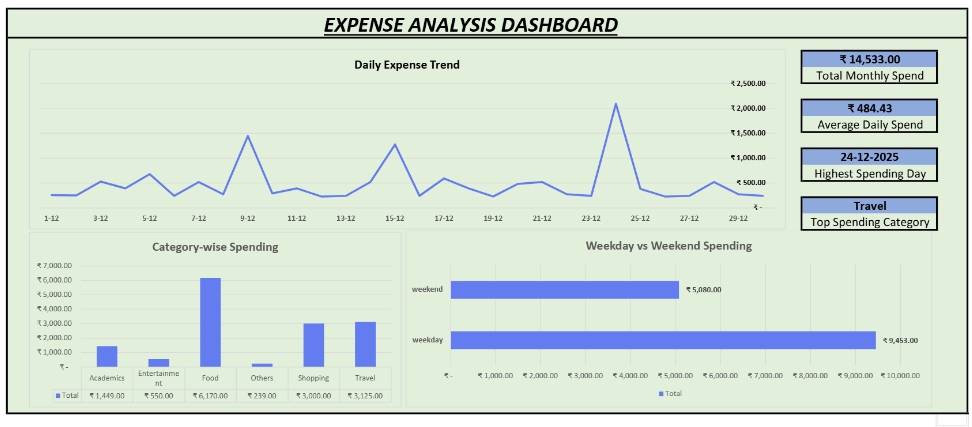

# Personal Expense and Spending Behavior Analysis

A portfolio data analytics project that examines one month of personal expense transactions to identify spending concentration, daily spikes, weekend behavior, and payment preferences. The project combines Excel reporting, reproducible MySQL analysis, and a deployable Streamlit web app.

## Business question

How did spending change during December 2025, which categories drove the budget, and where could discretionary spending be reviewed?

## Dashboard preview



## Results at a glance

| Metric | Result |
| --- | ---: |
| Analysis period | 1-30 Dec 2025 |
| Transactions | 119 |
| Total spend | INR 14,533 |
| Average daily spend | INR 484.43 |
| Highest-spend day | 24 Dec 2025 (INR 2,090) |
| Largest category | Food (INR 6,170; 42.5%) |
| Primary payment method | UPI (INR 12,613; 86.8%) |

## Key insights

- Food accounted for 42.5% of total spending, followed by Travel (INR 3,125) and Shopping (INR 3,000).
- Weekday spend was INR 9,453 versus INR 5,080 on weekends. The comparison is descriptive because the period contains more weekdays than weekend days.
- The three highest-spend days were 24 Dec (INR 2,090), 9 Dec (INR 1,445), and 15 Dec (INR 1,274), each well above the daily average.
- UPI represented 86.8% of expenditure, making payment-mode data especially useful for tracking cashless spending habits.

## Repository structure

```text
expense-spending-analysis/
|-- assets/                    # Dashboard PDF and preview image
|-- data/
|   |-- expense.xlsx           # Original Excel workbook
|   `-- expense_data.csv       # SQL-ready transaction extract
|-- sql/
|   |-- 01_schema.sql          # Database and table definition
|   `-- 02_analysis_queries.sql# Reproducible analysis queries
|-- app.py                     # Interactive Streamlit dashboard
|-- requirements.txt           # Python dependencies
|-- Dockerfile                 # Container deployment option
|-- .streamlit/config.toml     # App theme and server settings
|-- README.md
`-- RESUME_BULLETS.md
```

## Tools

- Microsoft Excel: data preparation, formulas, helper tables, charts, and dashboard
- MySQL 8: schema design, aggregations, CTEs, window functions, and data-quality checks
- SQL: category, payment-mode, daily, weekly, and weekday/weekend analysis
- Python, Streamlit, Pandas, and Altair: interactive filters, visual analytics, and CSV export

## Run the web app locally

```bash
python -m venv .venv
.venv\\Scripts\\activate
pip install -r requirements.txt
streamlit run app.py
```

The dashboard opens at `http://localhost:8501` and supports date, category, payment-mode, and weekday/weekend filters. Visitors can download the filtered transactions as CSV.

## Deploy to the web

### Streamlit Community Cloud

1. Push this project folder to a new GitHub repository.
2. In Streamlit Community Cloud, create an app from that repository.
3. Set the main file path to `app.py`, then deploy.

### Container host

The included `Dockerfile` can deploy to a container-capable host such as Render, Railway, or Google Cloud Run. The service must expose port `8501`.

## Run the SQL analysis

1. Create the schema by running `sql/01_schema.sql` in MySQL 8.
2. Import `data/expense_data.csv` into the `expenses` table using MySQL Workbench's Table Data Import Wizard. Map columns by name and allow the first row to be treated as headers.
3. Run `sql/02_analysis_queries.sql` to reproduce the analysis.

The Excel workbook remains the original dashboard deliverable. The CSV extract is provided to make the SQL workflow easy to reproduce without manually re-entering transactions.

## Data notes

This is a personal, de-identified sample for portfolio demonstration. Monetary values are reported in INR. The dataset covers 30 calendar days and should not be used to generalize behavior beyond this sample period.

## Data dictionary

| Field | Description |
| --- | --- |
| `expense_date` | Transaction date |
| `day_name` | Day of week recorded for the transaction |
| `day_type` | `weekday` or `weekend` |
| `category` | Expense group such as Food, Travel, or Shopping |
| `description` | Transaction-level purpose |
| `amount` | Expense amount in INR |
| `payment_mode` | Payment method, e.g. UPI or Cash |
